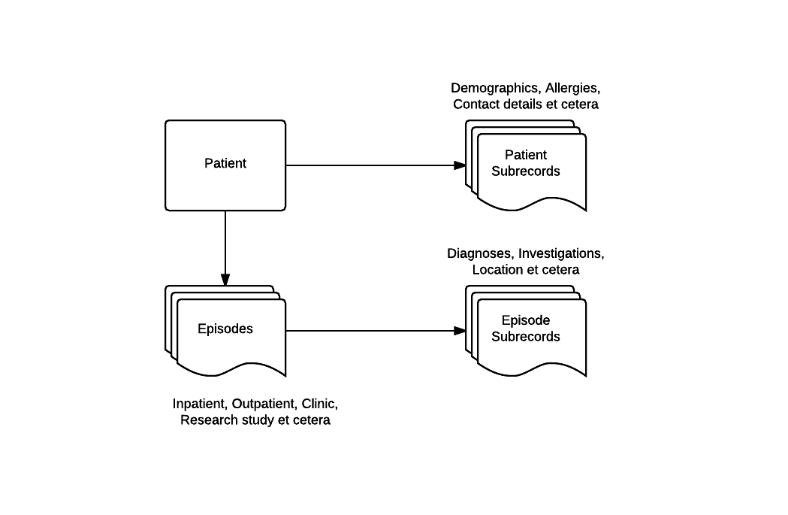

## The OPAL Data model

The OPAL data model allows for patients to have multiple sequential or concurrent
`Episodes of care`. Some information is linked to an `Episode`, some is linked to
a `Patient`.

### Location and TrackedModel abstract models
Location provides all the fields you might need to location a specific bed in a hospital
i.e. category, hospital, ward, bed

TrackedModel provides some basic audit fields created_by, created, updated_by, updated
the presumption is that these will be set by the update_to_dict model or manually in your
view this is so backend modification can happen without having to worry about corrupting
the audit trail.

### Patients

A `Patient` may have many `Episodes`. An `Episode` is something like an Inpatient admission,
a Telephone Liaison, care under an outpatient clinic, an appointment at a drop in clinic.
Applications or plugins may define their own `Episode` types, and a common pattern is to
alter the display or available functionality by episode type. (e.g. You may associate
templates for discharge summaries with particular episode types)

A `Patient` will have `Subrecords` (such as e.g. Demographics) which follow them across multiple
episodes. These are information linked to a particular person, and should be implemented as
Django models that inherit from the `opal.models.PatientSubrecord` base class.

### Episodes

An `Episode` is linked to a `Patient`, and will contain some metadata about the type and date
of the episode. The field `Episode.category` stores the type of episode ('Inpatient', 'Outpatient', ...)
while the fields `Episode.date_of_admission`, `Episode.discharge_date`, and `Episode.date_of_episode`
store information about when the `Episode` occurrs.

An `Episode` will have `Subrecords` (such as e.g. Diagnosis) which are linked to this episode of
care. These should be implemented as Django models that inherit from the `opal.models.EpisodeSubRecord`
base class.

### Records

A `Subrecord` consists of a collection of fields that constitute a record. For example, one could
implement a Demograpics `Subrecord` as follows:

    class Demographics(PatientSubrecord):
        name             = models.CharField(max_length=255, blank=True)
        hospital_number  = models.CharField(max_length=255, blank=True)
        nhs_number       = models.CharField(max_length=255, blank=True,
                                            null=True)
        date_of_birth    = models.DateField(null=True, blank=True)
        ethnicity        = models.CharField(max_length=255, blank=True,
                                            null=True)
        gender           = models.CharField(max_length=255, blank=True,
                                            null=True)

Subrecords also define various properties that will provide metadata about their
display or structure, which are documented in the
[Subrecord reference material](/reference/subrecords/)

### Lookup Lists

OPAL comes with a set of clinical terminology data models out of the box. - we often
want to link our records to one of these - for example to record a type of condition
a patient might have, or a drug they are taking.

Full documentation of these is available in the [Lookup lists](lookup_lists.md) documentation.
